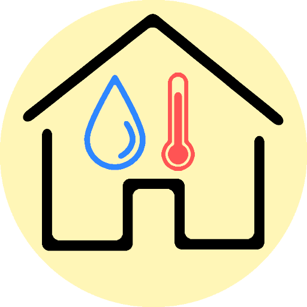
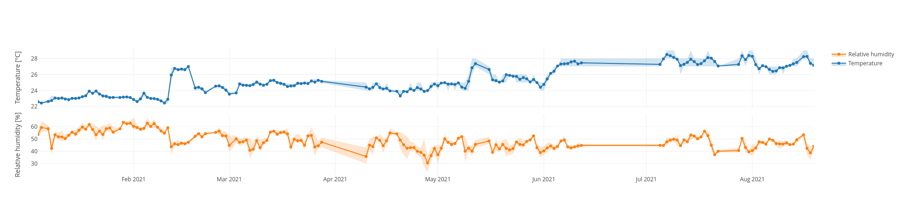
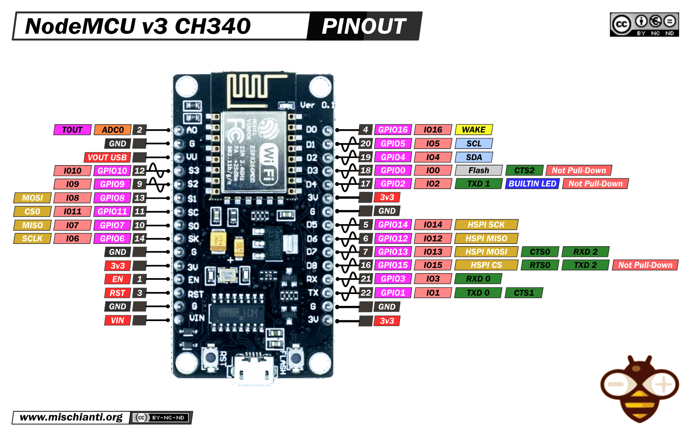
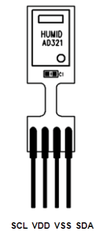

# homeMeteo

Distributed home meteorologic stations.

Based on the ChipCap2 sensor and nodeMCU development board. Data is pushed with an html post to the IST web server and saved on a mySQL DB.

[Online](
https://web.tecnico.ulisboa.pt/~andregtorres/homeMeteo/)

## NodeMCU

For my old node MCU boards, I had to downgrade the Esp Board Driver to 2.3.0 as seen [here](
https://github.com/FirebaseExtended/firebase-arduino/issues/460).

## ChipCap2 Wiring

The Chip uses I2C to communicate. There is already a arduino/nodeMCU library with all the wrappers for the functions. Using standard pins for I2C.  
The specific chip is the CC2D33-SIP (3.3V, digital, 3% accuracy).

Connections:

| ChipCap2      | NodeMCU | Wire color 0 | Wire color 1 |
| ----------- | ----------- | ----------- | ----------- |
| SLC      | D1       | orange| blue |
| VDD   | 3V        |  red| white-blue |
| VSS   | GND        | yellow| white-green |
| SDA   | D2        | green| green |
